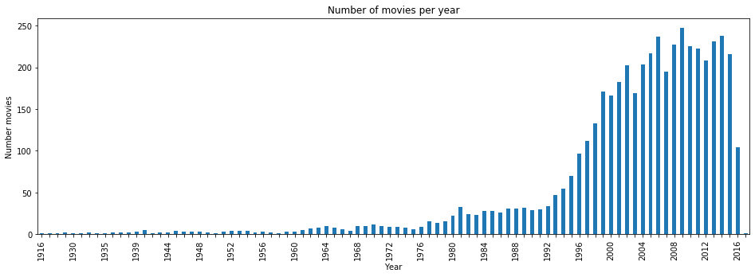
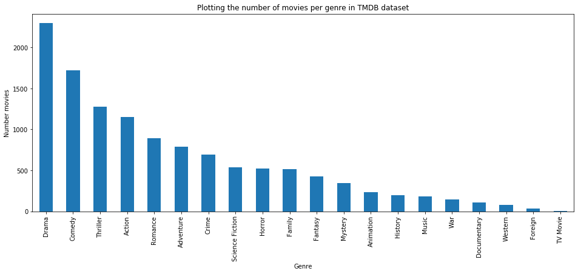
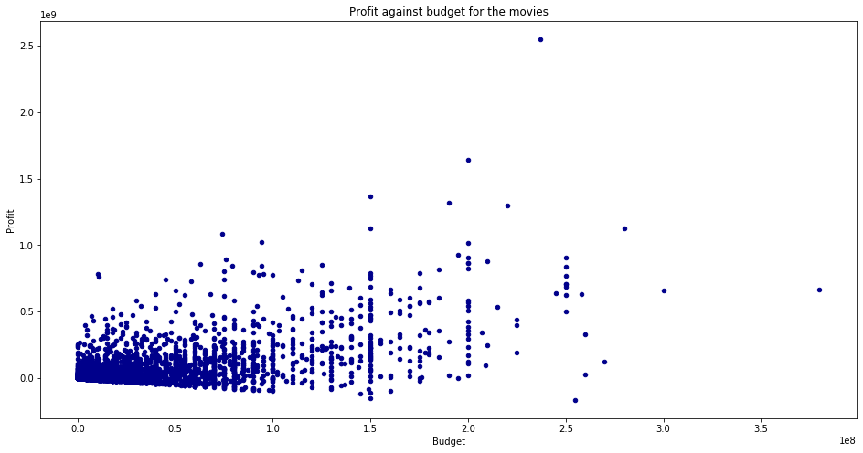

# Project of Data Visualization (COM-480)

| Student's name | SCIPER |
| -------------- | ------ |
| Maja Stamenkovic | 309017 |
| Jeremy Mion | 261178 |
| Johan Barthas | 313239 |

[Milestone 1](#milestone-1-friday-3rd-april-5pm) • [Milestone 2](#milestone-2-friday-1st-may-5pm) • [Milestone 3](#milestone-3-thursday-28th-may-5pm)

## Milestone 1 (Friday 3rd April, 5pm)

**10% of the final grade**


### 1. Problematic
#### 1.1. Overview:

Movies have become a central part of our lives all around the world and they are one of the most popular types of entertainment for us. We have come a long way since the public screening of ten of Lumière brothers’ short films in 1895 to Avengers:Endgame, a movie that recorded almost 2.8 billion dollars in gross, the highest of all-time. [wiki](https://en.wikipedia.org/wiki/List_of_highest-grossing_films) From a historical point of view, movies represent a reflection of our society and our culture. As the society changed, the movies changed as well, and by looking at the characteristics of the most popular movies of all times, we believe that we could see some interesting patterns and insights.

Although we sometimes watch movies just because they are exciting, thrilling and fun, their value is undoubtedly in acquiring ideas and lessons that we can apply in real life. We would like the same to apply to the visualization we create - you can enjoy the interface and have fun trying out the interactions, but we hope that you will also gain knowledge and find inspiration for your future work.

#### 1.2. Motivation & Target audience:

Nowadays, movies are part of everyone’s life. Whether you’re young or old, you prefer watching your favorite movie at home or the theater, alone or with other people. You might like watching movies just for a sake of fun and relax, and see that as a bonding activity with your friends and family. Movies might be your way to temporarily escape from real life and problems that surround you. Or you might be more serious movie lover, which appreciates movies as an art form and always tries to learn lessons and acquire knowledge and inspiration from them. Whichever group you belong, you will find something intriguing in our visualization. If movies are just visual entertainment for you, then you will appreciate elegant and interactive visualization we create which will give you a broad overview of the movie industry in the past century. Moreover, you will discover many trivia and fun-facts that you can share with your friends. But if you are a real film aficionado, then you will be overwhelmed with the possibility to get into the core of the most popular movies and the complex relationships that exist between them - from genres, production houses and directors, to runtimes and connections between actors. A real movie hobbyists always analyze a movie, direction, plot, acting and many such factors, and then on that basis review if the movie that they have watched is worth spending their time or not. We expect the same approach from them for our visualization - they will be our main criticists.

#### 1.3. Our goals:

Movie making is a visual art and visual entertainment on its own. We would all rather watch the latest blockbuster then look at the statistics about it. But we believe that, if done properly, visualizing the data about the movies can be fun as well. A good visualization can help the user decide which movie to watch the next, not just based on the overview of the movie, ratings of the other users or recommendation given by the website. If we give the users the opportunity to interactively explore the most popular movies of all time, they will be able to deepen their knowledge about the evolution of the movie industry and think critically about upcoming megahits.
The questions we want to tackle with our visualization:
* *What makes a good movie?* : Is it the production house that is making it? The genre it belongs to, or the location where it was filmed? Maybe it all depends on the year when the movie is released? By looking at the metadata about the popular movies, and by choosing the right ones which will be visualized, users can get insights and discover patterns among movies.


* *How similar are the most popular movies?* : Using the data we can show the connections that emerge between movies given in the dataset. We want to explore the connections that are created by actors that are playing in the movies, and also the keywords that are describing the movies. 

### 2. Dataset

The dataset that we will use is kaggle-one TMDB 5000 Movie Dataset. The dataset is created as replacement for the popular IMDB dataset which was removed due to DMCA takedown request from IMDB. It provides information about almost 5000 movies, and their data on the plot, cast, crew, runtimes, languages,  budget, revenues etc. The Dataset is divided into 2 csv files. The first file tmdb_5000_movies.csv contains basic data and statistics for the movies, like title, overview, release date, information about genre, production companies, keywords and popularity. The second file tmdb_5000_credits.csv contains data about cast and crew. The dataset is cleaned and processed according to universal standards eg. names of the countries where the movies are filmed are kept as codes defined in  ISO 3166 standard published by the International Organization for Standardization (ISO). Complex data which refers to production companies, spoken languages, cast and crew is kept in json format, so we assume that the data cleaning and preprocessing for the visualisation wouldn’t take much time.
This dataset was generated from The Movie Database API. Since the API also provides access to data on many additional movies, actors and actresses, crew members and TV shows, we might also use it for gathering additional data for the visualizations.

### 3. Exploratory data analysis:

Having done some basic preprocessing of the data we have produced a few intresting graphs.

To analyse this dataset, we used ```pandas``` library in Python 3.7, our work can be found in this [notebook](https://github.com/com-480-data-visualization/com-480-project-vizzybussy/blob/master/data_analysis.ipynb).
Working with the data we came accross some intresting statistics which include:
* There is a total of 4803 movies covering the years 1916-2017 even though the year 2017 should be omitted due to the lack of movies since this dataset was released in 2016.
* There are 54196 different actors that played in these films.
* There are 20 different genres of movies covered and the most popular are: Drama, Comedy, Thriller, Action, etc...

A pictures is worth a thousand words and therefore, you can find bellow some basic insights that were obtained from the dataset.


*Number of movies per year*


*Number of movies per genre*


*Profit against budget*

### 4. Related work

We have encountered several interesting visualizations regarding evolution of movies and their performance and statistics and some inspiration for our project includes:
* https://www.behance.net/gallery/44767671/100-Greatest-Movies-Data-Visualization : This poster brings the similar information as we want to do with TMDB dataset. It highlights the most successful movies per decade and the ratings and awards that they got, but also gives information about genres and production houses. We think that this visualization would be more powerful if it was interactive, and that is what we would like to achieve.
* http://bl.ocks.org/paulovn/9686202 : We love the idea of using TMDB data and graphs to visualize connections between the most popular movies. What would also be interesting is to see how the most popular movies create connections between actors.

Also, several visualizations from other fields and topics inspired us to try to apply same principles to visualize the data about film industry:
* https://www.gapminder.org/tools/#$chart-type=bubbles : This visualization inspired us to try to visualize the movie data in a way which shows the success of the movies in different years according to the popularity they had, with a possibility to explore which other factors might influence the result achieved - different colours can represent different genres, the size of the bubbles revenue achieved etc.
* https://music-timeline.appspot.com/ : We found a big inspiration in the visualization of another type of art - music. The timeline perfectly explains how music genres evolved over time, and the interactivity enables users to get even more details on the genres they find interesting. This plot is a real treasure for all music lovers, and we want to give movie enthusiasts the opportunity to enjoy the exploration of their beloved films in the similar way.


## Milestone 2 (Friday 1st May, 5pm)

**10% of the final grade**


## Milestone 3 (Thursday 28th May, 5pm)

**80% of the final grade**

